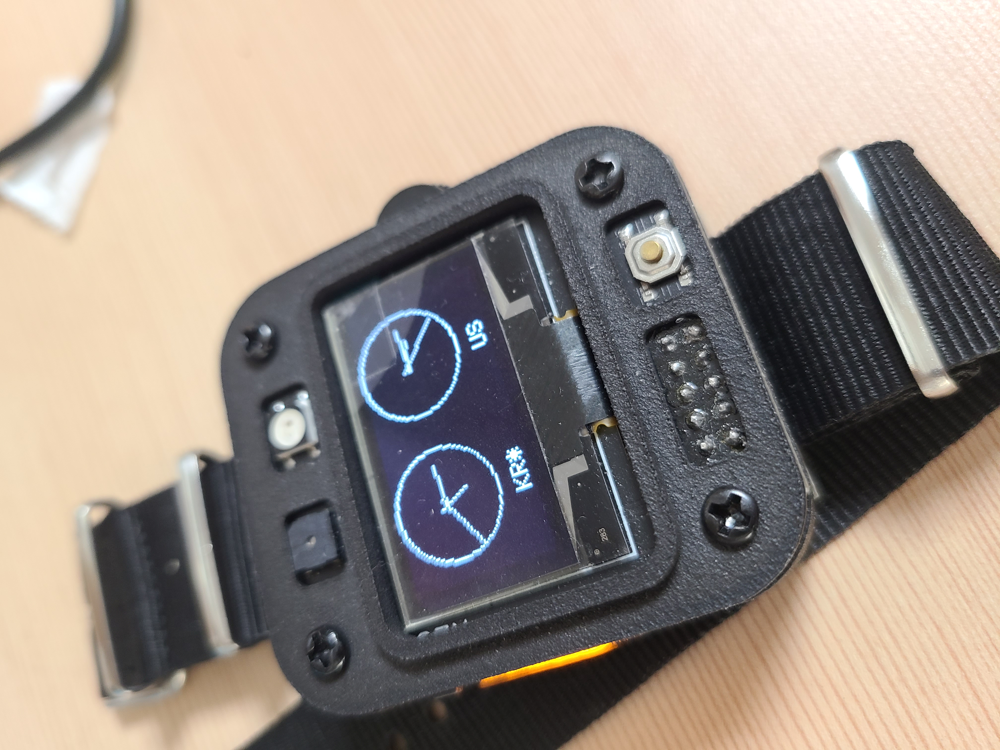

## sunghwan watch v.2 menu gui

we need GPS , Bluetooth and any function. my code is very low level. because i used leonardo. and this is size is smaller than uno. I like hardware.But now I am studying hard because the software is more fun and I am interested in embedded and firmware. I haven't done app development or web development yet. Don't you know? I wonder if I'm interested in web development.  

## design

## solve

BT APP  
BT cmd   
phone - BT -arduino  
git API - commit alarm  
now : commit watch -> TIMER function  

## How to show

close time - now time   

## sample

( TARGET : 13시 )  
 9시  59분 59초	->    0시  0분  0초  
10시   0분  0초	->    3시  0분  0초  
10시   0분  1초	->    2시 59분 59초  
10시   0분 59초	->    2시 59분  1초  
10시   1분  0초	->    2시 59분  0초  
10시  59분 59초	->    2시  0분  1초  
11시   0분  0초	->    2시  0분  0초  
11시   0분  1초	->    1시 59분 59초  

시작시간 남은 시간 목표 시간  

## build 

struct  
refactor  
