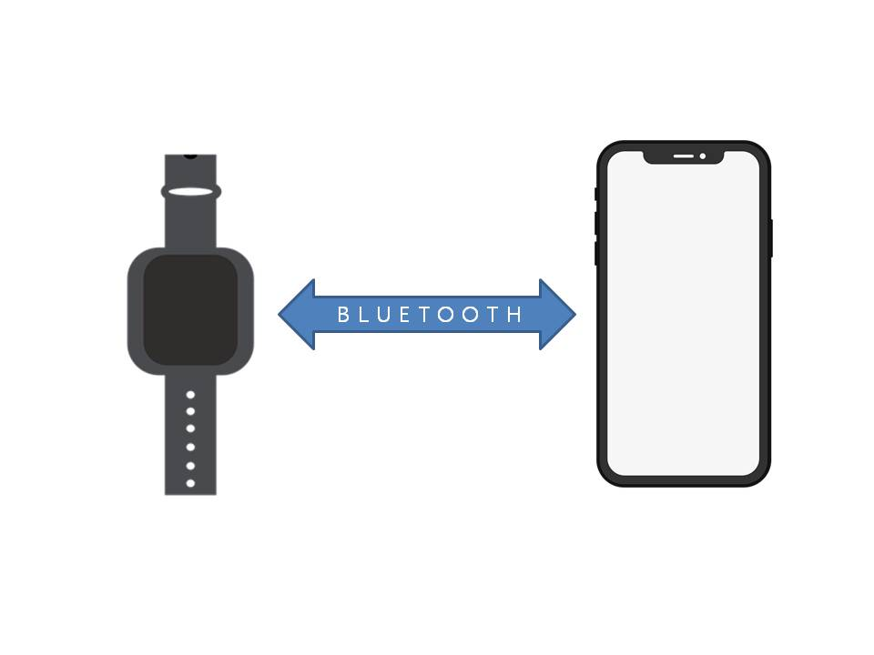
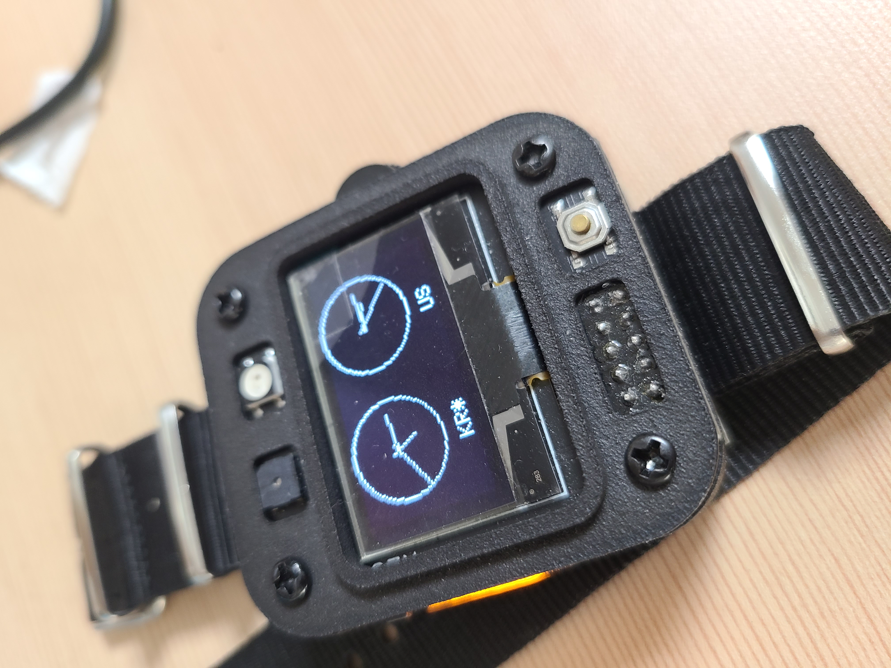
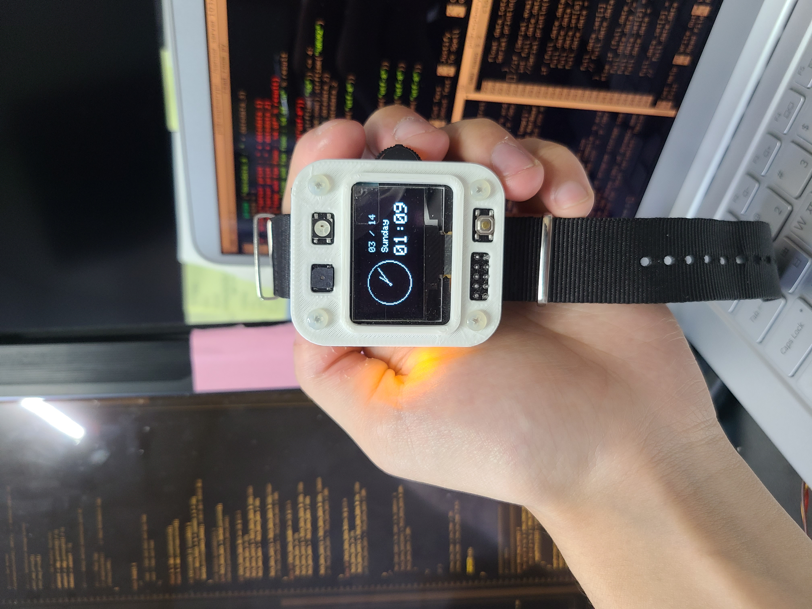

# Sunghwan watch v.2 menu gui  

자세한 내용은 [위키 페이지](https://ruffalolavoisier.github.io/OledWatch-Wiki)를 참조하시길 바랍니다.  

## Accessories Repositories

### [OledWatch-Wiki Page](https://ruffalolavoisier.github.io/OledWatch-Wiki)  

디바이스 전체 설명에 대한 자세한 내용을 기록하였습니다. 

### [Android APP](https://github.com/RuffaloLavoisier/OledWatch-Android)

손목시계와 스마트폰은 블루투스로 연동하여 주요 기능을 더욱 확장해서 사용할 수 있습니다. 

We communicate. It shares notifications, information, location, and device status with Android.  

## Intro

we need GPS , Bluetooth and any function. my code is very low level. because i used leonardo. and this is size is smaller than uno. I like hardware.But now I am studying hard because the software is more fun and I am interested in embedded and firmware. I haven't done app development or web development yet. Don't you know? I wonder if I'm interested in web development. 

우리는 GPS, 블루투스 그리고 모든 기능이 필요하다.  
아두이노 레오나르도를 사용하여 개발하기 때문에 메모리 사용에 신중합니다.  
점진적으로 코드를 수정하고 최소화할 수 있게 수정 중 입니다.  
이 크기는 uno보다 크기가 작고 전력 사용이 매우 적으며 저전력 모드를 구축할 것 입니다.  

## Model-Design

### Photo

    

>듀얼 시계 모드 입니다. 로컬 지역 TimeZone 외에 추가로 1개까지 설정할 수 있습니다.   

  

>아날로그 시계와 디지털 시계를 혼합한 모드 입니다.  2가지 형식의 장단점을 모아서 하나의 모드로 사용할 수 있게 구현하였습니다.  

  

>Menu GUI 진입한 모습입니다. 디바이스의 가장 큰 특징으로 Menu 기능을 첨가하여 친숙한 GUI 방식으로 개발하였습니다. 위 기능으로 진입할 시 시계 외에도 다양한 기능을 접할 수 있습니다.  

### Movie

Operate Watch : -> [Movie](https://www.youtube.com/watch?v=URcfMHQa684)  

>간단한 디바이스 작동 영상 및 기능 구현 영상 입니다.   

Receive Alarm : -> [push Alarm](https://www.youtube.com/watch?v=BIamCVrhSE8)   

>메신저 알림을 알려주는 기능 입니다.   